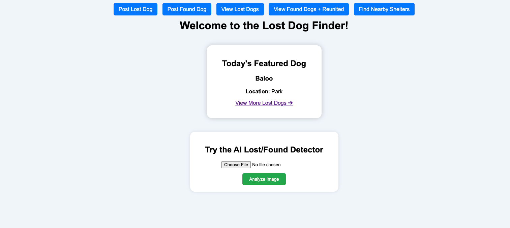
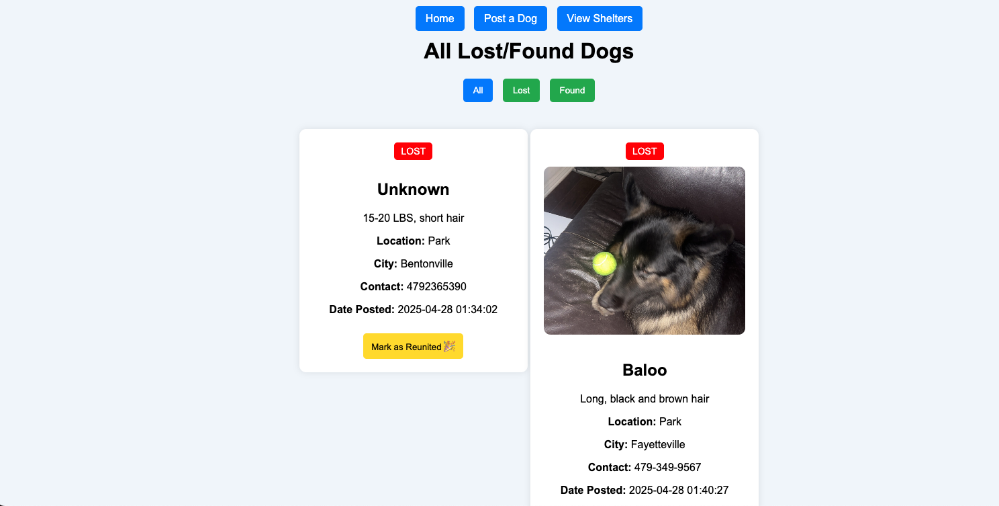
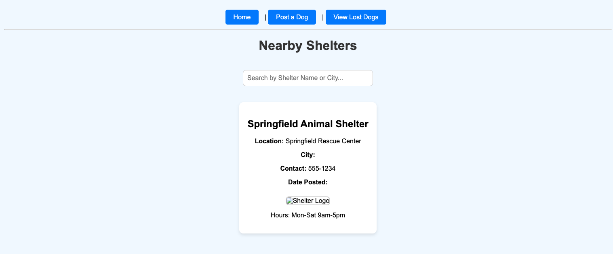
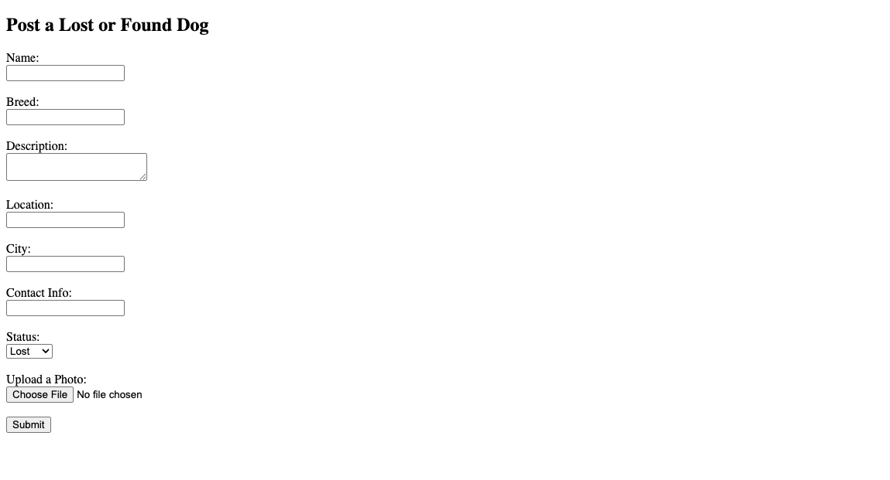
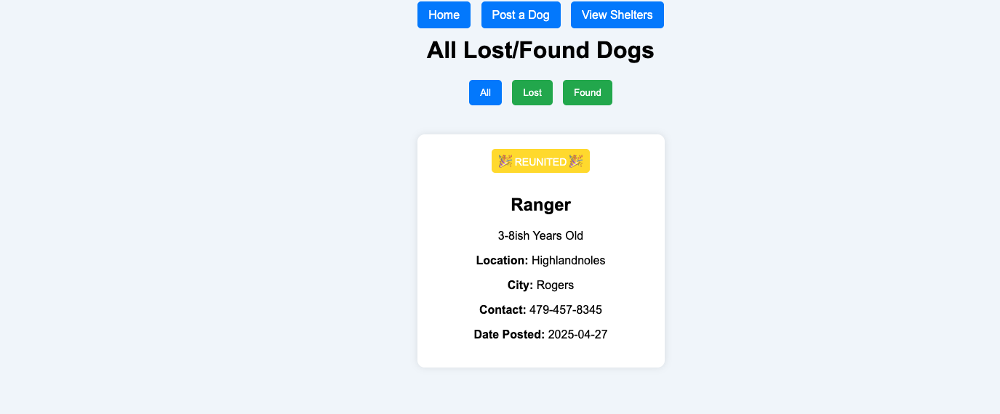

# 🐶 Lost Dog Finder AI App

## 📋 Project Description
This Flask web app helps reunite lost dogs with their owners using AI image classification and community posts. Users can upload photos of lost/found dogs, receive AI predictions, and browse local shelter listings. Mobile-ready and ngrok-enabled for live demos.

Built with **Flask**, **TensorFlow**, **OpenCV**, and **HTML/CSS**.

---

## 🚀 Features
- Upload dog photos for AI-based Lost/Found classification
- Post missing or found dogs with contact info and photo
- View current dog listings (Lost, Found, Reunited)
- Mark dogs as “Reunited” with a success story flow
- Display shelter-submitted dogs with hours & logos
- Mobile-optimized for fast camera uploads and sharing
- Public access via ngrok for live mobile demos

---

## 🛠️ How to Run
1. Clone this repository to your computer:

    ```bash
    git clone https://github.com/YOUR_USERNAME/lost-dog-ai-app.git
    ```

2. Move into the project folder:

    ```bash
    cd lost-dog-ai-app
    ```

3. Set up a virtual environment and install required packages:

    ```bash
    python -m venv venv
    source venv/bin/activate  # or venv\Scripts\activate on Windows
    pip install -r requirements.txt
    ```

4. Launch the app locally:

    ```bash
    python app.py
    ```

5. (Optional) Make it public on mobile using:

    ```bash
    ngrok http 5000
    ```

---

## 📂 Project Structure
---

## 📂 Project Structure

```
lost-dog-ai-app/
├── app.py
├── dog_match_model.h5
├── dog_posts.json
├── requirements.txt
├── routes/
│   └── routes.py
├── templates/
│   ├── index.html
│   ├── post_dog.html
│   ├── view_dogs.html
│   ├── view_shelters.html
│   └── result.html
├── static/
│   └── uploads/
└── screenshots/
    ├── homepage.png
    ├── view_dogs.png
    ├── shelters.png
    ├── post_form.png
    └── reunited.png
```

---

## 📸 Example Screenshots

### Homepage - Featured Dog & AI Upload  


### View Lost/Found Dogs  


### Nearby Shelters Listing  


### Post a Dog Form  


### Reunited Dog Example  


---

## 📚 Technologies Used
- Python  
- Flask  
- TensorFlow / Keras  
- OpenCV  
- HTML / CSS  
- JSON  
- ngrok

---

## 🗓️ Project Timeline (5 Weeks)

| Week | Dates            | What Was Completed                                    |
|------|------------------|--------------------------------------------------------|
| 1    | Mar 28 – Apr 4   | Defined project, repo setup, and proposal written     |
| 2    | Apr 5 – Apr 11   | Trained AI model and tested image classification      |
| 3    | Apr 12 – Apr 18  | Built Flask backend and homepage AI functionality     |
| 4    | Apr 19 – Apr 25  | Finished forms, shelter system, and UI improvements   |
| 5    | Apr 26 – May 1   | Finalized public access, README, and video prep       |

---

## 🔮 Future Plans
- Add Petfinder API to sync real missing dog listings  
- Display dogs/shelters on an interactive map  
- Enable direct camera access and instant uploads  
- Add facial vector comparison for lost dog matching  
- Launch SMS/email alert system for pet sightings

---

## 👨‍💻 Developer
- E. Alexander Apolskis

